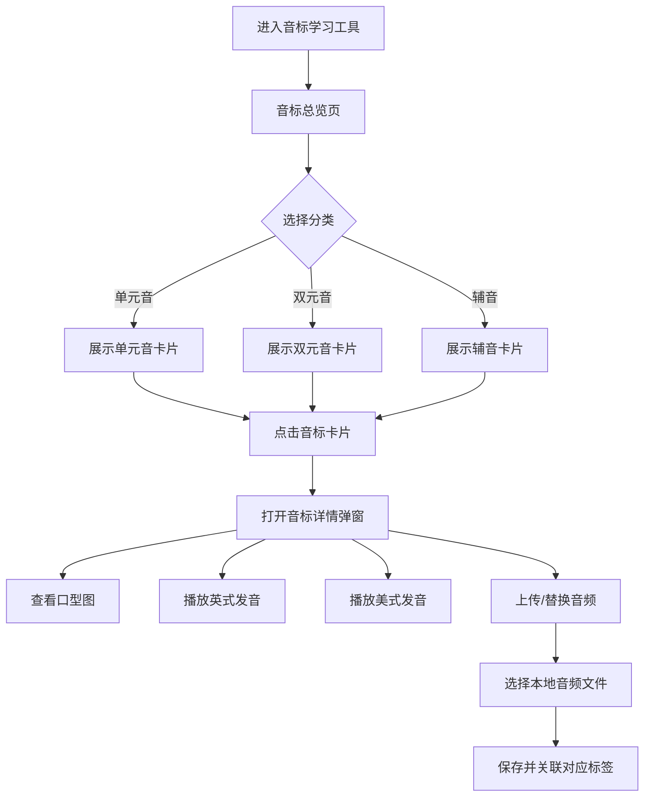

## 1. 产品概述

一款面向三年级小学生的英语音标学习工具，基于剑桥词典官网的国际音标（IPA）分类体系，预设完整的音标库并配套口型示意图，支持为每个音标独立上传英式发音和美式发音音频，帮助儿童通过视觉（口型图）和听觉（真人发音）多维度掌握英语音标。

- **目标用户**：三年级小学生（8-9岁）
- **核心价值**：将剑桥词典的权威音标体系转化为儿童友好的互动学习体验

## 2. 核心功能

### 2.1 用户角色

| 角色 | 描述 | 核心权限 |
|------|------|----------|
| 学习者 | 三年级学生 | 浏览音标、查看口型图、播放发音 |
| 家长/教师 | 辅助管理者 | 上传/替换英式或美式发音音频 |

### 2.2 功能模块

1. **音标总览页**：按分类展示全部音标卡片，支持分类筛选
2. **音标详情卡片**：展示单个音标的符号、口型图、例词及发音播放

### 2.3 页面详情

| 页面名称 | 模块名称 | 功能描述 |
|----------|----------|----------|
| 音标总览页 | 分类导航 | 按单元音、双元音、辅音三大类进行Tab切换筛选 |
| 音标总览页 | 音标卡片网格 | 以卡片网格展示音标符号、口型缩略图、英式/美式播放按钮 |
| 音标总览页 | 搜索栏 | 支持按音标符号或例词搜索 |
| 音标详情弹窗 | 口型大图 | 展示清晰的口型示意图 |
| 音标详情弹窗 | 发音播放区 | 英式发音和美式发音独立播放按钮，带音频波形或进度条 |
| 音标详情弹窗 | 音频上传区 | 家长可为英式/美式分别上传替换音频文件 |
| 音标详情弹窗 | 例词展示 | 展示包含该音标的例词及对应图片 |

## 3. 核心流程

## 4. 用户界面设计

### 4.1 设计风格

- **主色调**：温暖的珊瑚橙（#FF6B6B）搭配柔和的奶油色背景（#FFF8F0），营造温馨、活泼的儿童学习氛围
- **辅助色**：天空蓝（#4ECDC4）用于英式标签，阳光黄（#FFE66D）用于美式标签，便于儿童快速区分
- **按钮风格**：大圆角按钮（border-radius: 16px），带有轻微3D阴影效果，点击有缩放反馈动画
- **字体**：标题使用圆体风格（Nunito / 系统圆体），音标符号使用 serif 字体以保证IPA符号正确渲染
- **布局风格**：卡片网格布局，每个音标为独立卡片，卡片之间间距充足，适合儿童操作
- **图标风格**：使用 lucide-react 图标库，线条清晰简洁
- **动画**：卡片悬停上浮、点击涟漪效果、弹窗弹性缩放进入

### 4.2 页面设计概览

| 页面名称 | 模块名称 | UI元素 |
|----------|----------|--------|
| 音标总览页 | 顶部标题栏 | 大标题"音标小课堂"，副标题说明，配色温暖活泼 |
| 音标总览页 | 分类导航Tab | 三个大圆角Tab按钮：单元音、双元音、辅音，当前选中高亮 |
| 音标总览页 | 音标卡片网格 | 每个卡片含：音标符号（大号字体）、口型缩略图占位、英式/美式迷你播放按钮 |
| 音标详情弹窗 | 弹窗容器 | 白色圆角卡片，居中弹出，带半透明遮罩，弹性动画入场 |
| 音标详情弹窗 | 口型图区 | 大尺寸口型示意图占位，带柔和边框和阴影 |
| 音标详情弹窗 | 发音控制区 | 英式发音行：英国国旗图标 + 播放按钮 + 上传按钮；美式发音行：美国国旗图标 + 播放按钮 + 上传按钮 |
| 音标详情弹窗 | 例词区 | 2-3个例词，每个配有插图占位 |

### 4.3 响应式设计

- **桌面端优先**：最大宽度1200px居中，卡片网格4-6列
- **平板适配**：768px以下切换为2-3列卡片网格
- **手机适配**：480px以下单列卡片布局，弹窗占满屏幕

## 5. 音标预设数据

按剑桥词典IPA体系，预设以下音标分类：

**单元音（12个）**：/iː/ /ɪ/ /e/ /æ/ /ɑː/ /ɒ/ /ɔː/ /ʊ/ /uː/ /ʌ/ /ɜː/ /ə/

**双元音（8个）**：/eɪ/ /aɪ/ /ɔɪ/ /əʊ/ /aʊ/ /ɪə/ /eə/ /ʊə/

**辅音（24个）**：/p/ /b/ /t/ /d/ /k/ /ɡ/ /f/ /v/ /θ/ /ð/ /s/ /z/ /ʃ/ /ʒ/ /tʃ/ /dʒ/ /m/ /n/ /ŋ/ /h/ /l/ /r/ /j/ /w/

每个音标预设：符号、例词、口型图占位、英式音频空位、美式音频空位。
