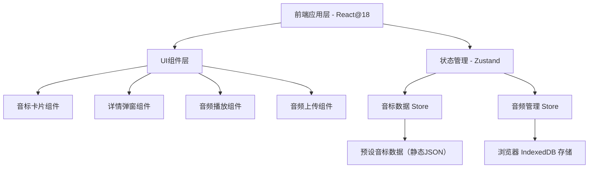

## 1. 架构设计



## 2. 技术说明

- **前端框架**：React 18 + TypeScript
- **样式方案**：Tailwind CSS 3
- **构建工具**：Vite
- **初始化工具**：vite-init（react-ts 模板）
- **状态管理**：Zustand
- **图标库**：lucide-react
- **数据持久化**：IndexedDB（通过 idb 库），存储用户上传的音频 Blob 数据
- **后端**：无（纯前端应用，所有数据本地存储）

## 3. 路由定义

| 路由 | 用途 |
|------|------|
| / | 音标总览页（唯一页面，弹窗形式展示详情） |

## 4. 组件结构

```
src/
├── components/
│   ├── Header.tsx           # 顶部标题栏
│   ├── CategoryTabs.tsx     # 分类导航Tab（单元音/双元音/辅音）
│   ├── SearchBar.tsx        # 搜索栏
│   ├── PhonemeGrid.tsx      # 音标卡片网格容器
│   ├── PhonemeCard.tsx      # 单个音标卡片
│   ├── PhonemeDetail.tsx    # 音标详情弹窗
│   ├── AudioPlayer.tsx      # 音频播放按钮组件
│   └── AudioUploader.tsx    # 音频上传组件
├── data/
│   └── phonemes.ts          # 预设音标数据（44个音标）
├── store/
│   └── usePhonemeStore.ts   # Zustand 状态管理
├── utils/
│   └── db.ts                # IndexedDB 操作工具
├── App.tsx
└── main.tsx
```

## 5. 数据模型

### 5.1 音标数据类型定义

```typescript
type AccentType = 'uk' | 'us';

interface PhonemeData {
  id: string;                    // 唯一标识，如 "vowel-iː"
  symbol: string;                // IPA符号，如 "/iː/"
  category: 'vowel' | 'diphthong' | 'consonant';  // 分类
  examples: string[];            // 例词，如 ["sheep", "sleep"]
  mouthImage: string;            // 口型图URL（占位图或用户替换）
  audioUK: string | null;        // 英式发音音频URL/BlobURL
  audioUS: string | null;        // 美式发音音频URL/BlobURL
}

interface PhonemeStore {
  phonemes: PhonemeData[];
  activeCategory: 'vowel' | 'diphthong' | 'consonant' | 'all';
  searchQuery: string;
  selectedPhoneme: PhonemeData | null;
  
  setCategory: (category: PhonemeStore['activeCategory']) => void;
  setSearchQuery: (query: string) => void;
  selectPhoneme: (id: string) => void;
  closeDetail: () => void;
  updateAudio: (id: string, accent: AccentType, audioBlob: Blob) => Promise<void>;
  removeAudio: (id: string, accent: AccentType) => void;
}
```

### 5.2 IndexedDB 存储结构

```typescript
// 数据库名：phoneme_audio_db
// 对象存储：audio_files
// 键：phonemeId_accent (如 "vowel-iː_uk")

interface AudioRecord {
  id: string;          // "phonemeId_accent"
  phonemeId: string;
  accent: AccentType;
  blob: Blob;
  fileName: string;
  uploadedAt: number;  // timestamp
}
```

## 6. 音频处理方案

- 使用 HTML5 `<input type="file" accept="audio/*">` 实现音频文件选择
- 通过 `URL.createObjectURL()` 生成临时播放URL
- 通过 IndexedDB 持久化存储音频 Blob，实现刷新后保留
- 每个音标独立存储英式和美式两份音频
- 上传按钮附带标签（英国国旗/美国国旗图标区分）
